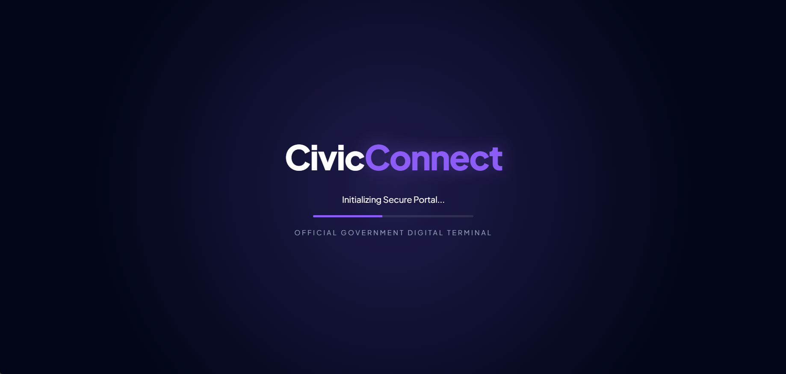
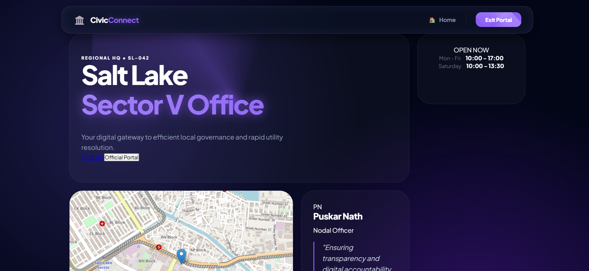
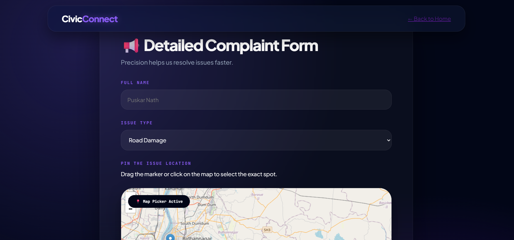
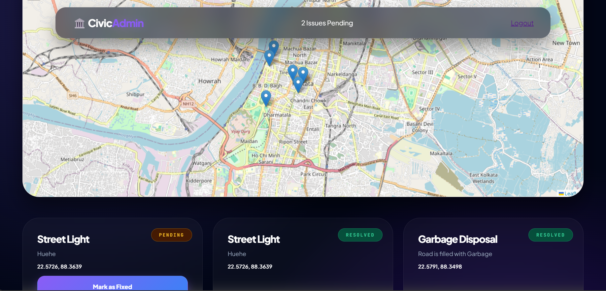
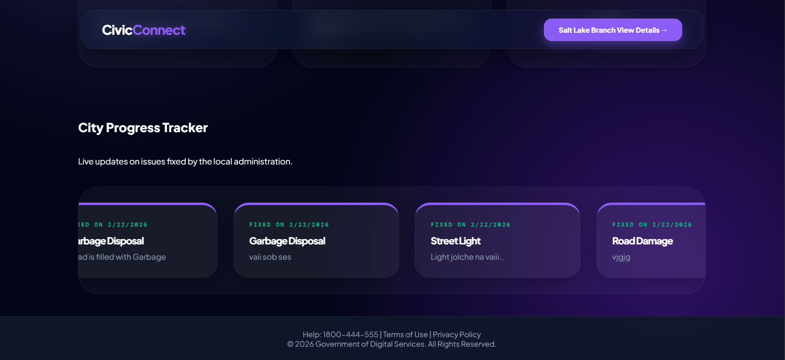

  
  
   

  <h1 align="center">🏛️ CivicConnect</h1>
  

    <b>The Obsidian Command Center for Modern Municipal Governance</b> 
    Authorized Digital Terminal for Salt Lake Sector V • Nodal Office SL-042
  

  

    
    
    
  

<h2 align="center">🖥️ Interface Intelligence Preview</h2>
<table width="100%" border="0" cellspacing="10" cellpadding="0">
  <tr>
    <td width="66%" rowspan="2" valign="top">
      
<b>ULTRA-WIDE TERMINAL VIEW</b>

        
      
      
<i>Landing Architecture: Glassmorphic Hero with Radiant Indigo Glow</i>

    </td>
    <td width="33%" valign="top">
      
<b>SECURE INITIALIZATION</b>

      
      
<i>5-Second Holographic Splash Logic</i>

    </td>
  </tr>
  <tr>
    <td width="33%" valign="top">
      
<b>ADMIN MASTER MAP</b>

      
      
<i>Inverted Dark-Mode Leaflet Tracker</i>

    </td>
  </tr>
</table>

<h2>💎 Elite Design Philosophy</h2>
<blockquote>
  CivicConnect is engineered as a <b>Heavy CSS Terminal</b>. 
  The project utilizes an asymmetric <b>Bento Grid</b> and a deep <b>Obsidian Navy</b> palette to provide 
  an authoritative digital environment for the citizens of Sector V.
</blockquote>

<table width="100%">
  <tr>
    <td width="50%" valign="top">
      <h3>🚀 Kinetic Interactions</h3>
      <ul>
        <li><b>Synchro-Reveal:</b> 5s holographic splash entry.</li>
        <li><b>Physics-Based Cards:</b> Cubic-Bezier hover scaling.</li>
        <li><b>Glassmorphism:</b> 25px background blur saturation.</li>
      </ul>
    </td>
    <td width="50%" valign="top">
      <h3>📡 Real-Time Intelligence</h3>
      <ul>
        <li><b>Infinite Marquee:</b> Seamless success tracker for resolved tasks.</li>
        <li><b>Cloud Logic:</b> Firestore-backed state synchronization.</li>
        <li><b>GPS Accuracy:</b> Leaflet.js coordinate pin-drop.</li>
      </ul>
    </td>
  </tr>
</table>

<table width="100%" border="0">
  <tr>
    <td width="20%" valign="top">
       
      
       
    </td>
    <td width="80%" valign="middle">
      <h2>👨‍💼 Regional Administration (SL-042)</h2>
      

        The Sector V terminal is under the strategic oversight of <b>Nodal Officer Puskar Nath</b>. 
        Under his leadership, this branch manages civic utility escalations with absolute digital accountability 
        and real-time transparency.
      

    </td>
  </tr>
</table>

<h2>🛠️ Technical Infrastructure</h2>
<table width="100%">
  <tr>
    <th align="left">Category</th>
    <th align="left">Documentation Details</th>
  </tr>
  <tr>
    <td><b>Global Typography</b></td>
    <td>Elite scale using <b>Plus Jakarta Sans</b> with -4px letter-spacing.</td>
  </tr>
  <tr>
    <td><b>Backend Vault</b></td>
    <td>Firebase Cloud Firestore with real-time snapshot listeners.</td>
  </tr>
  <tr>
    <td><b>Frontend Logic</b></td>
    <td>Vanilla JS with <b>Cubic-Bezier</b> animation transitions.</td>
  </tr>
</table>

<h2 align="center">📡 Extended System Modules & Asset Gallery</h2>

A deep dive into the terminal's sub-systems and operational logic.

<table width="100%" border="0" cellspacing="10" cellpadding="0">
  <tr>
    <td width="33%" valign="top">
      
<b>01. PORTAL BOOTSTRAP</b>

      
      
<i>Synchronized 5s secure handshake sequence.</i>

    </td>
    <td width="33%" valign="top">
      
<b>02. BENTO DASHBOARD</b>

      
      
<i>Heavy-CSS layout for Salt Lake HQ.</i>

    </td>
  <tr>
    <td width="33%" valign="top">
      
<b>04. INFINITE MARQUEE</b>

      
      
<i>Seamless success loop for public trust.</i>

    </td>
    <td width="33%" valign="top">
      
<b>05. NAVIGATION LOGIC</b>

      
      
<i>Branch detail routing and state management.</i>

    </td>
  </tr>

  <tr>
    <td width="50%" valign="top">
      
<b>VERIFIED NODAL OFFICER: PUSKAR NATH</b>

      
      
<i>Nodal Office (SL-042) Primary Supervisor.</i>

    </td>
    <td width="50%" valign="top">
      
<b>DEVELOPMENT ENVIRONMENT (IDE)</b>

      
      
<i>Active coding session in VS Code (main branch).</i>

    </td>
  </tr>
</table>

<h3 align="center">📑 Operational Registry</h3>

  
  
  

 

<table width="100%" align="center">
  <tr>
    <th align="left">Log ID</th>
    <th align="left">Action Performed</th>
    <th align="left">Nodal Verification</th>
  </tr>
  <tr>
    <td><code>SYNC-001</code></td>
    <td>Triple-data loop logic implemented for infinite marquee.</td>
    <td>✅ Verified (SL-042)</td>
  </tr>
  <tr>
    <td><code>CSS-042</code></td>
    <td>Heavy-Duty Glassmorphism applied to Salt Lake Branch Portal.</td>
    <td>✅ Verified (SL-042)</td>
  </tr>
  <tr>
    <td><code>MAP-999</code></td>
    <td>Restored Leaflet.js original color profile for citizen readability.</td>
    <td>✅ Verified (SL-042)</td>
  </tr>
</table>

   

